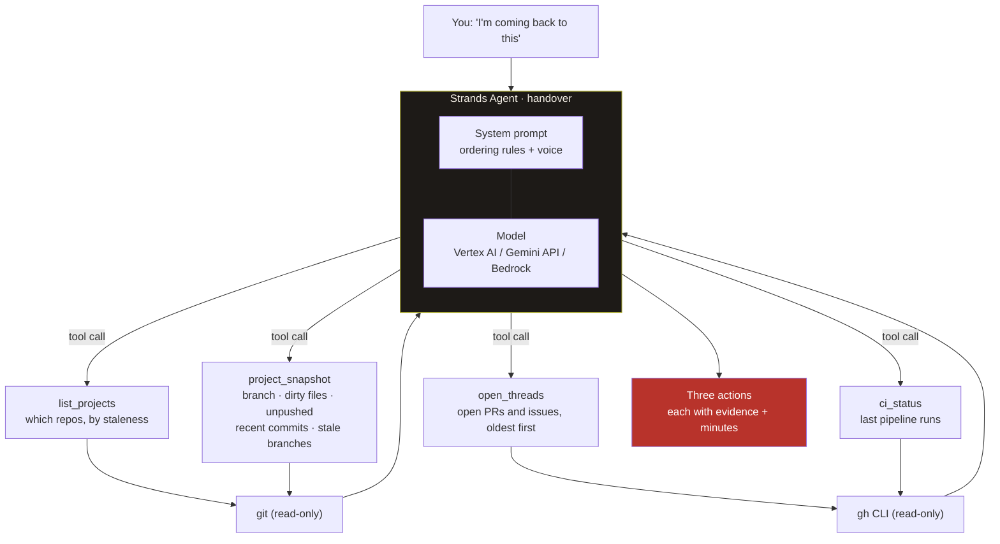

# standup

**What to do first when you come back to a project you left.**

You open a repo you have not touched in six weeks. The first hour goes on working out where you were: what is half-finished, what someone else is waiting on, which branch was the live one. By the time you know, the evening is gone.

`handover` reads the project's real state and tells you the three things to do first, each with the evidence it saw and how long it will take.

Built with the [Strands Agents SDK](https://strandsagents.com) for the [Agents for Humans Hackathon](https://agentsforhumans.devpost.com).

## What it actually does

```
$ handover ~/dev/hyper-cv

1. Reconcile local main with upstream
   Evidence: 4 unpushed commits on main, and local main is 27 commits behind origin/main.
   Action:   git pull --rebase origin main, run the tests, push.
   Estimate: 15 minutes

2. Resume the NextRole landing & PAYG credits thread
   Evidence: your last commit 41 days ago refined landing assets, following a
             14-task PAYG plan documented in the recent docs(credits) commits.
   Action:   read the plan doc, pick the next task.
   Estimate: 20 minutes

3. Prune 6 stale local branches
   Evidence: six branches untouched for 137 to 159 days.
   Action:   check each for unmerged work, delete the abandoned ones.
   Estimate: 10 minutes

Beyond tonight: triage the 10 open issues, starting with #118.
```

That is real output from a real repository, not a mock.

## How it decides

The ordering is the product. Anything a *person* is waiting on beats anything private; then anything that will be lost or painful later; then the thread you were actually pulling when you stopped.

It never tells you off for leaving. People leave projects because life happens, so it opens with what is still standing.

## Architecture



Every tool is read-only. `handover` runs `git` and `gh` to look, never to change. It cannot commit, push, comment or close anything.

## Run it

```bash
python -m venv .venv && .venv/bin/pip install -e .
cp .env.example .env          # Vertex service account, a Gemini API key, or AWS credentials for Bedrock
handover ~/dev/some-project   # one repo
handover ~/dev                # or a directory of them
```

The model provider is chosen at runtime: a Vertex service account if one is configured, otherwise a Gemini API key, otherwise Strands falls back to Amazon Bedrock using your AWS credentials.

## Licence

MIT. Built by [Hyperdrift](https://hyperdrift.io).
