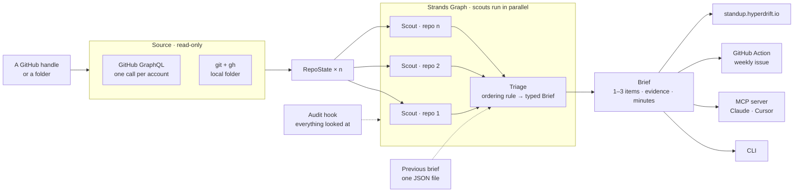

# Standup

**Type a GitHub handle. See who is waiting on you.**

Someone opened a pull request on your project nine days ago and you still have not looked, because looking means six tabs and three threads before you know whether it even needs you. So it sits there, and the person who wrote it decides you are not maintaining this any more. Standup does that reading for you and hands back three things to do, each with the evidence it saw and how long it will take.

Built with the [Strands Agents SDK](https://strandsagents.com) for the [Agents for Humans Hackathon](https://agentsforhumans.devpost.com).

## Real output

`trekhleb`, a stranger, on the hosted page. Twelve public repositories, 52 seconds, nothing typed but the handle. These are the model's words, unedited:

```
Main pipelines across javascript-algorithms, yesbrainer, and trekhleb.github.io are green, with clean zero-open-item states on trekhleb/trekhleb, cali-vibe, and hello-docker.

1. Review fresh cryptography and documentation PRs  (javascript-algorithms)
   YaronKoresh is waiting.
   Evidence: YaronKoresh opened PR #2073 0 days ago; chenlichao opened PR #2188 1 day ago; lisagorewitdecker opened security PRs #2202 and #2205 within the last 6 days.
   Action:   Review and merge PR #2073 (SHA-256 implementation) and PR #2188 documentation fix.
   Estimate: 25 minutes

2. Review Siteefy tool submission PR #23  (promote-your-next-startup)
   Lupimi is waiting.
   Evidence: Lupimi opened PR #23 'Add Siteefy free tool submission' 4 days ago.
   Action:   Review PR #23 and merge if the proposed link fits repository criteria.
   Estimate: 10 minutes

3. Respond to web crawler resource proposal in issue #103  (trekhleb.github.io)
   AndyNian is waiting.
   Evidence: AndyNian opened issue #103 'Deep-dive resource proposal for the web crawler sketch' 14 days ago.
   Action:   Reply to issue #103 regarding the proposed web crawler resource link.
   Estimate: 10 minutes

Beyond tonight: Address older community pull requests in learn-python (PRs #113-#115) and triage container startup issue #1 in claude-pod.

What Standup looked at (read-only):
  2026-09-09T02:39:31Z  read 12 public repositories on GitHub
  2026-09-09T02:39:32Z  ran scout_trekhleb
  2026-09-09T02:39:32Z  ran scout_learn_python
  2026-09-09T02:39:32Z  ran scout_jobs_radar_web_snapshot
  2026-09-09T02:39:32Z  ran scout_hello_docker
  2026-09-09T02:39:32Z  ran scout_trekhleb_github_io
  2026-09-09T02:39:32Z  ran scout_nano_neuron
  2026-09-09T02:39:32Z  ran scout_yesbrainer
  2026-09-09T02:39:32Z  ran scout_machine_learning_octave
  2026-09-09T02:39:32Z  ran scout_promote_your_next_startup
  2026-09-09T02:39:32Z  ran scout_cali_vibe
  2026-09-09T02:39:32Z  ran scout_javascript_algorithms
  2026-09-09T02:39:32Z  ran scout_claude_pod
  2026-09-09T02:40:01Z  ran triage
```

## How it decides

The ordering is the product. Anything a *person* is waiting on beats anything private. Then anything that will be lost or painful later. Then the thread you were pulling when you stopped.

Bots are named and dropped: a Dependabot pull request is never someone waiting. A quiet account gets one item, not a padded three.

It never tells you off for leaving. People leave projects because life happens, so the brief opens with what is still standing.

## Read-only, and it shows you

The agent has no GitHub write path — no token scope for it, no tool that could use one. A hook records every read as it happens and the brief carries that list, printed at the bottom of every run and on the page. Read-only is shown, not claimed.

The one thing that ever writes is the last step of the GitHub Action: your token, your repository, one issue.

## Try it

**[standup.hyperdrift.io](https://standup.hyperdrift.io)** — type a handle, wait about a minute. No install, no login. The URL is shareable and the brief stays for an hour.

## Install

**CLI**

```bash
pip install "git+https://github.com/hyperdrift-io/standup"
standup trekhleb          # a GitHub handle or org
standup ~/dev/my-project  # or a folder of repositories
```

Set `GOOGLE_SA_KEY_B64` + `VERTEX_PROJECT`, or `GEMINI_API_KEY`, or leave both unset and Strands falls back to Amazon Bedrock with your AWS credentials (see `.env.example` and `src/standup/model.py`). `GITHUB_TOKEN` is read from the environment, falling back to `gh auth token`.

**MCP server** — ask Claude or Cursor "what should I do first on my projects?" and the brief comes back in the tool you already have open. Claude Desktop, `claude_desktop_config.json`:

```json
{"mcpServers": {"standup": {"command": "/path/to/.venv/bin/standup-mcp",
  "env": {"GOOGLE_SA_KEY_B64": "…", "VERTEX_PROJECT": "…"}}}}
```

Cursor takes the same block in `.cursor/mcp.json`. One tool, `standup(target)`.

**GitHub Action** — copy [`examples/standup.yml`](examples/standup.yml) into `.github/workflows/`, add the model secret, and Monday morning brings an issue instead of a backlog.

## Architecture



- **One GraphQL call per account.** `repositoryOwner(login:)` reads a person and an organisation the same way, and costs 1 point of the 5,000 GitHub gives you per hour. Repositories pushed within the last year, most recent first, twelve at most; forks and archives skipped.
- **A Strands `Graph`.** One scout agent per repository, all of them in flight at once, each returning a typed `RepoRead` — what moved, who is waiting, what will hurt, the dropped thread. One triage agent reads all of it, applies the ordering rule, and returns a `Brief` through `structured_output`. That single Pydantic shape feeds the CLI text, the MCP result, the Action's issue body and the page.
- **A hook on tool and node events** appends every read to the audit that ships with the brief.
- **One JSON file per handle** holds the last brief, so the next run can open with what changed since. No accounts, no database.
- **The model** is Vertex Gemini by default, a Gemini API key or Amazon Bedrock otherwise.

## What it cannot see

Private repositories — invisible to it, by design. Anything quiet for more than a year, or past the twelve most recently pushed. Anything that happened off GitHub: the Slack thread, the email, the person who gave up and never opened the issue. When a scout or the API falls short, the brief says so in its own words rather than quietly shrinking.

## Licence

MIT. Built by [Hyperdrift](https://ai.hyperdrift.io/?from=standup).
